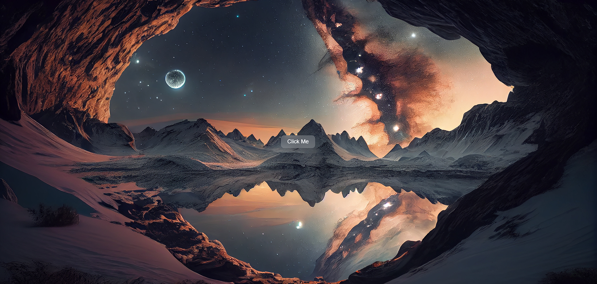

---
# :star: Test_2(Glassmorphism)
This project demonstrates a simple implementation of the glassmorphism effect using HTML, CSS, and JavaScript. 

# :camera: Screenshots

# :sparkles: Features
- Glassmorphism effect on button and panel
- Responsive design
- Interactive elements with JavaScript
- Clean and modern UI

# :hammer_and_wrench: Stack used

**Front-end:** HTML, CSS, JavaScript
    
# :busts_in_silhouette: Authors
- [@imbiel-dev](https://www.github.com/imbiel-dev)